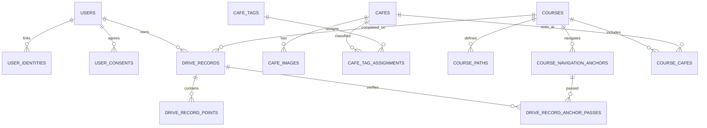
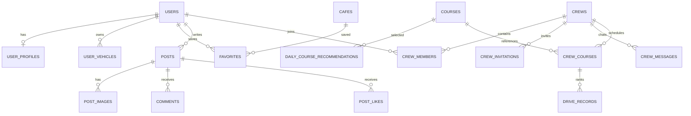
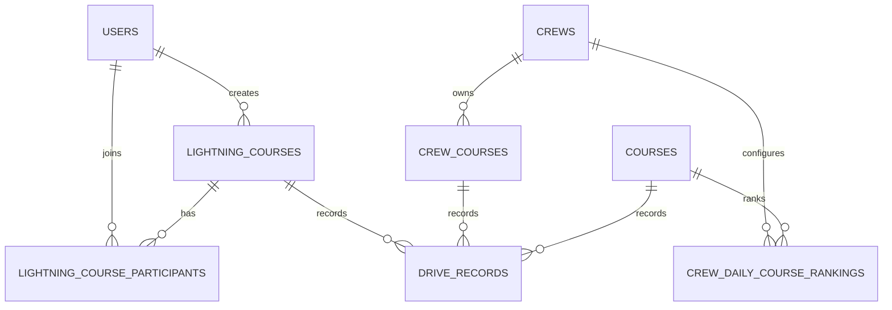

# WayPoint 전체 ERD

## 현재 구현된 핵심 관계

| 테이블 | 역할 | 상태 |
| --- | --- | --- |
| `users`, `user_identities`, `user_consents` | 사용자·소셜 계정·동의 이력 | 구현 |
| `cafes`, `cafe_images`, `cafe_tags` | 검수된 카페와 검색 조건 | 구현 |
| `course_paths` | 전체 코스 폴리라인과 검증 기준 | 구현 |
| `course_navigation_anchors` | TMAP에 전달할 시작·경유·도착점 | 구현 |
| `course_cafes` | 코스의 카페 휴식 포인트 | 구현 |
| `drive_records` | 주행 요약·기준 시간 차이·검증 결과 | 구현 |
| `drive_record_points` | GPS 원본 포인트 | 구현 |
| `drive_record_anchor_passes` | 필수 경유지 통과 증거 | 구현 |

## 다음 마이그레이션에서 추가할 도메인

| 테이블 | 핵심 컬럼/제약 |
| --- | --- |
| `user_profiles` | `user_id` 유니크, 닉네임, 소개, 프로필 이미지 |
| `user_vehicles` | 차종, 제조사, 모델, 대표 차량 여부 |
| `favorites` | `(user_id, cafe_id)` 유니크 |
| `daily_course_recommendations` | `(recommendation_date, display_order)` 유니크, 공통 추천 3개 |
| `posts`, `post_images` | 작성자, 본문, 이미지 순서, 공개·삭제 상태 |
| `comments`, `post_likes` | 대댓글 부모 ID, `(post_id, user_id)` 좋아요 유니크 |
| `reports`, `user_blocks` | 커뮤니티 운영과 사용자 보호 |
| `crews` | 공개 여부, 가입 정책, 소유자 |
| `crew_members` | `(crew_id, user_id)` 유니크, OWNER/MANAGER/MEMBER |
| `crew_invitations` | 초대 토큰 해시, 만료 시각, 사용 상태 |
| `crew_messages` | 크루 내부 대화와 삭제 상태 |
| `crew_courses` | 코스·기준 시간·FASTEST/CLOSEST_TO_BASELINE 랭킹 모드 |

커뮤니티와 크루 테이블은 UI 흐름이 확정된 뒤 별도 Alembic 마이그레이션으로 추가한다.
한 번에 모든 테이블을 확정하면 진행 중인 Figma 화면과 충돌할 가능성이 있기 때문이다.
# 2026-07-15 MVP 확장 테이블

공개 번개와 크루 데이터가 섞이지 않도록 다음 관계를 추가했다.

- `lightning_courses`: 전체 공개, 선택한 날짜 하루만 노출되는 출발지·목적지 기반 코스
- `lightning_course_participants`: 공개 번개 참가자와 주행 권한
- `crew_courses`: 크루원에게만 보이는 당일 번개코스
- `crew_daily_course_rankings`: 동일한 오늘의 코스 기록을 크루원만 필터링하는 랭킹 규칙
- `drive_records`: `course_id`, `crew_course_id`, `lightning_course_id` 중 정확히 하나를 사용
