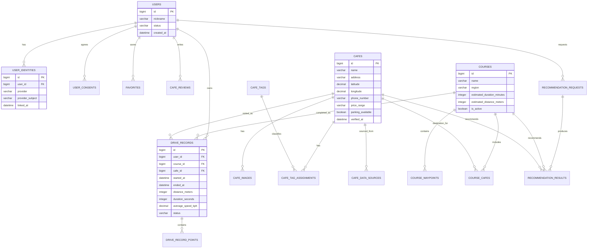

# MVP ERD 및 데이터 모델

## 관계도

## 핵심 테이블

| 테이블 | 목적 | 주요 제약·인덱스 |
| --- | --- | --- |
| `users` | 서비스 사용자 | `status`로 탈퇴·정지 상태 관리 |
| `user_identities` | 카카오/구글 계정 연결 | `(provider, provider_subject)` 유니크, `user_id` 인덱스 |
| `user_consents` | 위치·약관 동의 이력 | 동의 문서 버전과 시각 보관 |
| `cafes` | 검수된 카페 기본 정보 | 좌표 및 `is_active` 인덱스 |
| `cafe_images` | 사용 권한이 확인된 카페 사진 | 표시 순서와 라이선스·출처 저장 |
| `cafe_tags` | 분위기·뷰·편의시설 태그 사전 | `code` 유니크 |
| `cafe_tag_assignments` | 카페-태그 다대다 관계 | `(cafe_id, tag_id)` 유니크 |
| `cafe_data_sources` | 카페 정보 수집 출처·검수 이력 | 출처 URL, 수집·검수 시각 저장 |
| `courses` | 운영자가 검수한 드라이브 코스 | 지역, 시간·거리, 공개 상태 |
| `course_waypoints` | 코스의 순서 있는 경유지 | `(course_id, sequence)` 유니크 |
| `course_cafes` | 코스와 목적지 카페 연결 | 추천 가중치와 연결 상태 저장 |
| `favorites` | 사용자 즐겨찾기 | `(user_id, cafe_id)` 유니크 |
| `cafe_reviews` | 서비스 내 사용자 리뷰 | 사용자당 카페별 1건 유니크 |
| `recommendation_requests` | 추천 조건과 요청 이력 | 개인정보 최소화, 좌표는 정밀도 축소 저장 권장 |
| `recommendation_results` | 후보별 점수·경로 추정값 | 요청별 순위 유니크 |
| `drive_records` | 완주·중단된 드라이브 요약 | 사용자·시작 시각 복합 인덱스 |
| `drive_record_points` | 선택적으로 저장하는 GPS 원본 | `(drive_record_id, recorded_at)` 복합 인덱스 |

## 중요 설계 결정

### 소셜 계정 분리

`users`에 카카오 또는 구글 ID를 직접 넣지 않는다. `user_identities`를 두어 한 사용자가 두 제공자 계정을 연결할 수 있게 한다. 제공자 액세스 토큰은 영구 보관하지 않으며, 앱 로그인 후 서비스 자체 JWT만 사용한다.

### 태그 정규화

주차·뷰·분위기 같은 조건을 열로 계속 추가하지 않는다. `cafe_tags`와 연결 테이블을 사용한다. 단, 조회가 매우 잦은 `parking_available`, 좌표, 가격대는 `cafes`에 유지한다.

### GPS 저장

`drive_records`에는 사용자에게 보이는 요약값만 저장한다. 원본 좌표는 `drive_record_points`로 분리한다. 대량 데이터가 쌓이는 테이블이므로 보존 기간, 샘플링 간격, 삭제 정책을 별도 운영 정책으로 둔다.

### 랭킹

MVP에서는 `drive_records`를 집계해 코스 이용 수와 완주 수를 계산한다. 트래픽이 커진 뒤에만 일·주 단위 집계 테이블을 추가한다. 속도 순위는 제공하지 않는다.
